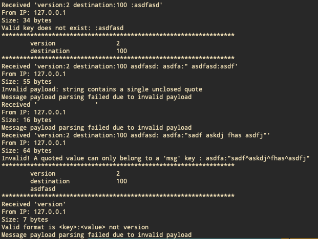
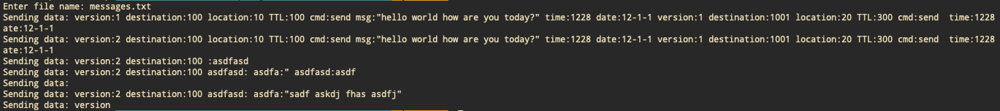

# CSE5462 Lab 1

## 1. How to run

```
make clean
make
./server1 <port> &
./client1 <server-IP> <server-port>

```

The client program will prompt user to input file path where payload exists (eg. messages.txt) and will print out the lines present in the file and sent to server

```
Enter file name: messages.txt
Sending data: version:1 destination:100 location:10 TTL:100 cmd:send msg:"hello world how are you today?" time:1228 date:12-1-1 version:1 destination:1001 location:20 TTL:300 cmd:send  time:1228 date:12-1-1
Sending data: version:2 destination:100 location:10 TTL:100 cmd:send msg:"hello world how are you today?" time:1228 date:12-1-1 version:1 destination:1001 location:20 TTL:300 cmd:send  time:1228 date:12-1-1
Sending data: version:2 destination:100 :asdfasd
Sending data: version:2 destination:100 asdfasd: asdfa:" asdfasd:asdf

```

## 2. Server

```
start
    1. create and bind socket
    2. initialize a linked list to store received payloads

loop:
    1. receive from client
    2. Store processed payload from client into linked list

```

### Payload Validation

1. No '^' character is allowed in the payload. RESULT: payload message invalidated and discarded
2. Key is mandatory in key-value pairs
```
 :asdf -> invalid key-value pair
```
``` 
 asdf: -> valid key-value pair
```
3. Only one quoted string allowed which belongs to 'msg' key. More than one 'msg' keys make payload invalid
4. Multiple whitespace characters are discarded between key-value pairs


### Sample output from the server - printing received payload after processing key-value pairs

---


---

## Client

```
1. create a socket
2. prompt user for payload file
3. extract lines from payload file
4. send line one after the other to server
```

### Sample output from client program

---


---
