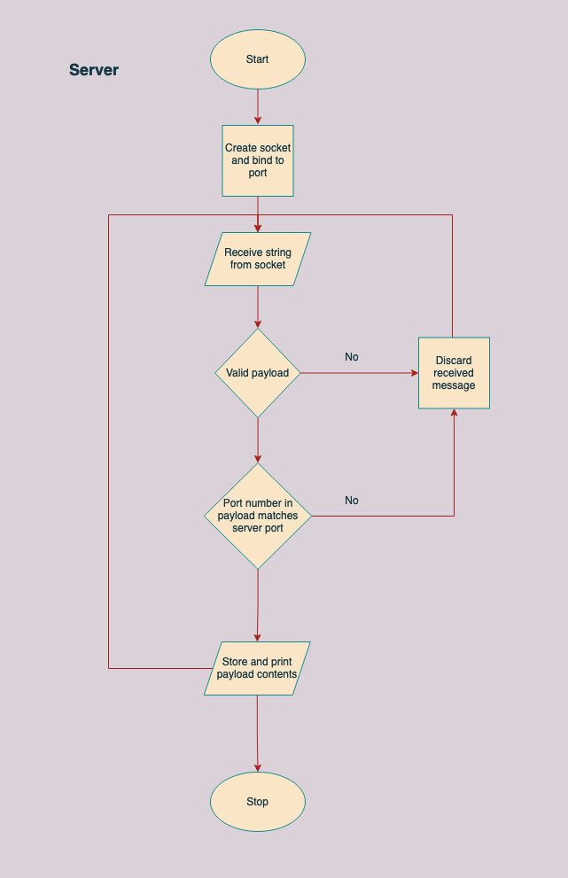
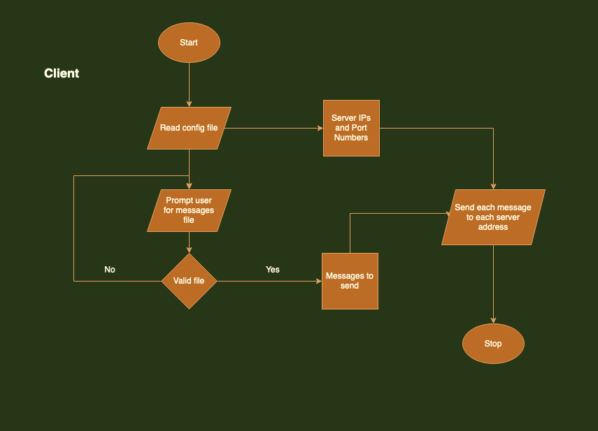

# CSE5462 Lab 2


## 1. How to run

To build the server2 and client2 binaries, run:
```
make clean
make
```

The server program takes port number as a command line argument:
```
./server2 <port> &
```

The client expects no command line arguments but will prompt user for inputting
the path of the messages file consisting of strings to be sent to servers:
```
./client2
```

Note: The CLI argument for the client program has been removed for Lab 2 as decided in class. Check all other guidelines for lab 2 [here](#4-guidelines-and-assumptions)


## 2. Server



## 3. Client



## 4. Guidelines and Assumptions

1. Max servers: 30
2. Config file in same directory as executable 
3. No command line arguments for the client program. **Do not prompt user for the config file**.
4. IP and port numbers read from config file
5. Max amount of lines sent to a single server: 50
6. Max number of characters in a line: 200
7. Max key:value pairs in a line: 20
8. No duplicate keys 🔑
9. If a message has multiple “port” key values, **this message is not valid**.
    - For example: `msg:”bob” port:1000 port:1001` 
10. Prompting for a messages text file after running ./client. **Same as Lab 1**.
11. Able to send all messages to one server then move to the next server or do it differently where you send one line, move to next server, and repeat. **This is an implementation detail and left up to user**.
12. Config file:
    - Delimited/separated by spaces only
    - New lines indicated by ‘\n’

---
